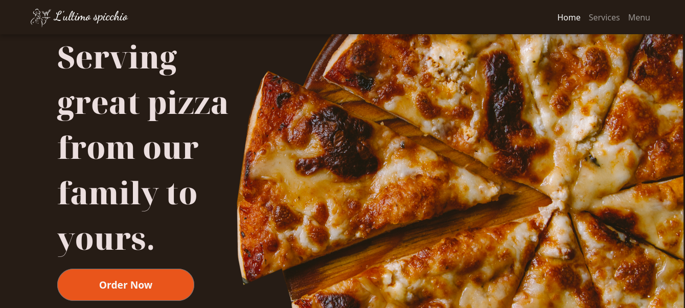

# L’ultimo_Spicchio

## Table of Content

- [Description](#description)
- [Screenshot](#screenshot)
- [Installation](#install-requirements)
- [Technology Used](#technology)
- [License](#license)
- [Authors Info](#authors-Info)

## Description

This is a web application for a pizza Restaurant.

## Screenshot

## Install Requirements

- Computer

- Internet Access

- Git

- Terminal

## Installation

On your computer open terminal and run:

    git clone https://github.com/qurriahSam/pizzaRestaurant.git

[Go Back to the top](#L’ultimo_Spicchio)

## Technology

- Semantic HTML5 Markup - Has been used to build the structure of the page.

- CSS Custom properties - Has been used to style the landing page.

- JavaScript - Has been used to create the business logic.

- Bootstrap - Has been used for styling the navbar and other elements on the landingpage.

- JQuery - Has been used for javascript Functionality

## Links

- Live Site URL: [L’ultimo_Spicchio](https://qurriahsam.github.io/pizzaRestaurant/)

[Go Back to the top](#L’ultimo_Spicchio)

## License

[MIT](./LICENSE) License.

[Go Back to the top](#L’ultimo_Spicchio)

## Authors Info

Linked - [Sam Kuria](https://www.linkedin.com/in/sam-kuria-0904b01a1)

[Go Back to the top](#L’ultimo_Spicchio)
